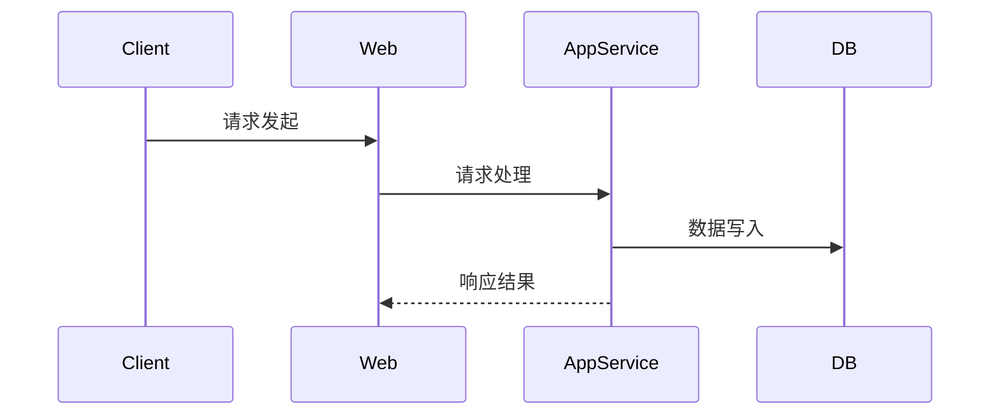

# 技术方案生成

**页面ID:** 2832915253  
**URL:** https://confluence.shopee.io/pages/viewpage.action?pageId=2832915253

# 技术方案设计文档规范
## 一、关键规则
* 技术方案文档必须遵循统一的章节结构，包括：名词解释、领域模型、应用调用关系、详细方案设计等核心内容。
* 名词解释部分应建立业务与技术的统一语言，术语需通俗易懂。
* 领域模型部分需描述核心业务实体及其关系，推荐使用 UML 图或 ER 图进行可视化。
* 应用调用关系需体现应用间接口调用、消息队列生产消费关系等跨模块通信路径。
* 详细方案设计需聚焦代码改动点、接口定义与实现、数据模型、分层架构说明等。
* 强调 **实现思路与设计逻辑**，而不仅仅是变更内容罗列。
* 所有对外接口协议变更（字段、路径等）必须体现在接口文档更新中。
* 所有项目默认采用标准分层架构进行技术方案设计。

## 二、技术方案文档模板
````markdown
# 技术方案设计文档：[方案名称]
## 文档信息
- 作者：[作者]
- 版本：[v1.0]
- 日期：[2025-06-24]
- 状态：[草稿/评审中/已确认]
# 一、名词解释
| 术语 | 说明 |
|------|------|
| 示例1 | 示例说明 |
| 示例2 | 示例说明 |
# 二、领域模型
## 核心实体说明
[列出与本方案相关的业务实体、属性与职责]
## 实体关系图
[使用 Mermaid UML classDiagram 或 ER 图展示实体关系]
```mermaid
classDiagram
Order --> Item
Order : +id
Order : +status
Item : +name
Item : +price
````
# 三、应用调用关系
## 系统架构图
[展示方案涉及模块、服务、消息队列等组件之间关系]
```mermaid
flowchart TD
Web -->|调用| AppService
AppService -->|写入| DB[(数据库)]
AppService -->|发送MQ| MQ[(消息队列)]
Consumer -->|消费| MQ
```
## 时序图（关键交互流程）

# 四、详细方案设计
## 架构模式说明
采用标准 Web 应用分层架构：
```
- Controller：接口层，负责请求处理、参数校验
- Service：业务层，负责业务逻辑实现、服务编排
- Repository：数据层，负责持久化操作
- Domain（可选）：封装业务规则与核心模型
```
## 数据模型设计
```
- DTO：数据传输对象
- BO：业务对象
- DO：领域对象
- PO：数据库持久化对象
```
## 接口设计与改动
### [接口名称]
* 请求路径：[HTTP 方法] /api/xxx
* 功能说明：[接口用途]
* 请求参数：
```json
{
"param1": "value1"
}
```
* 响应参数：
```json
{
"code": 200,
"data": {
"id": 123,
"status": "success"
}
}
```
* 接口变更说明：[新增/修改/废弃字段/变更字段含义等]
## 代码设计与改动点
* **Controller 层**：说明新增或修改的 Controller 类、方法，以及其职责。
* **Service 层**：说明新增业务服务、调用链及其逻辑要点。
* **Repository 层**：说明数据访问方式变化。
* **领域层（如有）**：说明业务模型变更或新增领域规则。
## 数据库设计与变更
### 新增/修改表结构
| 字段 | 类型 | 是否为空 | 主键 | 说明 |
| --- | ------ | ---- | --- | --- |
| id | bigint | 否 | 是 | 主键 |
| ... | ... | ... | ... | ... |
### 索引设计
| 索引名 | 字段 | 类型 | 说明 |
| -------- | ------ | -- | ------ |
| idx\_xxx | field1 | 普通 | 提升查询性能 |
## 配置变更（如有）
| 配置项 | 新值 | 说明 |
| ----------------- | ---- | ------- |
| xxx.enableFeature | true | 启用新功能开关 |
## 非功能性需求
### 性能要求
* 最大并发：XX
* 响应时间：≤ XX ms
### 可用性与容错
* 部署策略：多副本部署
* 异常恢复机制：...
### 扩展性
* 支持未来哪些方向的扩展：模块化插件、数据隔离等
## 兼容性与迁移
### 向后兼容性
* 与旧接口是否兼容？
* 数据模型是否需要迁移脚本？
### 平滑迁移方案
* 采用双写机制 / 灰度发布策略
## 风险与应对措施
| 风险项 | 影响范围 | 发生概率 | 应对策略 |
| ---- | ---- | ---- | ----------- |
| 示例风险 | 中 | 中 | 引入监控预警，回滚预案 |
---
## 三、方案撰写流程
1. **架构识别**
* 明确项目是否符合标准三层架构
* 判断是否涉及中间件（MQ、缓存等）
2. **需求分析**
* 梳理业务流程、核心模块、接口变更
* 明确扩展点、参数字段变动等信息
3. **方案撰写**
* 完整填充模板中的各个章节
* 突出"为什么这么设计"而非"设计了什么"
4. **评审验证**
* 完成自查、内部评审
* 引入 SRE、安全、架构、测试多方意见
---
## 四、示例（添加商品接口）
### 分层结构
```
# Controller
- com.cursor.product.web.ProductController
- 方法：addProduct()
# Service
- com.cursor.product.service.ProductServiceImpl
- 方法：addProduct()
# Repository
- com.cursor.product.repository.ProductRepository
- 方法：insert(ProductDO)
```
### 调用链
1. Controller 接收请求参数，校验并转发至 Service。
2. Service 执行业务逻辑，调用 Repository。
3. Repository 执行数据持久化操作。