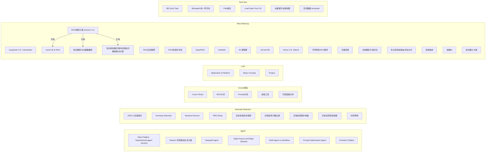

# 文档关系图

## 统计

| 指标 | 数值 |
|------|------|
| 文档总数 | 49 |
| 文档间交叉引用 | 3 |
| 外部链接 | 70 |
| Confluence 图片 | 9 |
| 分类数 | 6 |

## 交叉引用详情

| 来源文档 | 引用目标 |
|----------|----------|
| 05.Data IDE/RAG+Memory/RAG调研方案 (version 0.1).md | 05.Data IDE/RAG+Memory/vector db & RAG.md |
| 05.Data IDE/RAG+Memory/RAG调研方案 (version 0.1).md | 05.Data IDE/RAG+Memory/知识图谱与向量数据库.md |
| 05.Data IDE/RAG+Memory/RAG调研方案 (version 0.1).md | 05.Data IDE/RAG+Memory/知识库构建流程中的潜在问题和解决方案.md |